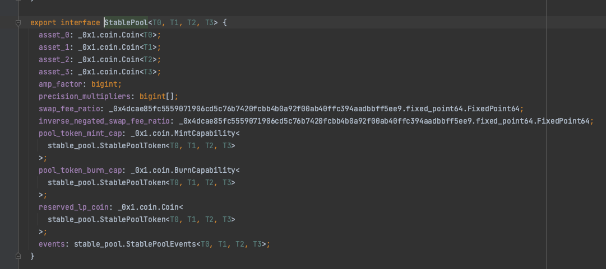
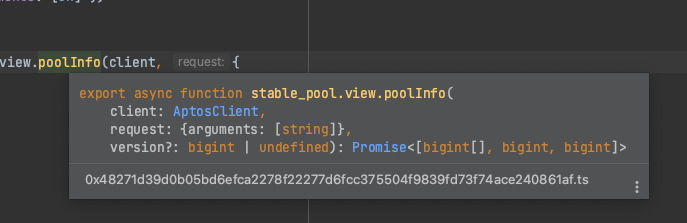

# Typemove 
Generate TypeScript bindings for Aptos contracts.
## Features
 - Code generation for Aptos smart contract based on ABI
 - Typesafe encode/decoding, object filtering, transaction building, etc
 - Automatically manage depended modules
## Usage
### Install package
```shell
yarn add @typemove/aptos
```
or 

```shell
pnpm add @typemove/aptos
```

### Code Generation
```typescript
yarn typemove-aptos [--target-dir] [--network] [--abi-dir] <location>
```
- `location`: Directory of ABI json files or address of account to generate types for
- `target-dir`: Directory to output generated files (default: "./types")
- `network`:  Network to use, could be either "mainnet", "testnet" or any node URL (default: "mainnet")
- `abi-dir`:  Directory to store downloaded ABI. Only useful if <location> is address (default: "./abis")

Use `yarn typemove-aptos --help` to see detail description.

A few examples:
- generate types for an address on mainnet:
    ```typescript
    yarn typemove-aptos --target-dir=./src/types --abi-dir=./src/abis 0x48271d39d0b05bd6efca2278f22277d6fcc375504f9839fd73f74ace240861af 
    ```
- generate types for local ABI files stored in `./src/abis`:
    ```typescript
    yarn typemove-aptos --target-dir=./src/types ./src/abis
    ```
- generate types using local node:
    ```typescript
    yarn typemove-aptos --network="http://localhost:8080" 0x48271d39d0b05bd6efca2278f22277d6fcc375504f9839fd73f74ace240861af
  ```

### Decode object

Generated type will be like this:


You can write code as follows:
```typescript
import { defaultMoveCoder } from '@typemove/aptos'
import { stable_pool } from "./types/0x48271d39d0b05bd6efca2278f22277d6fcc375504f9839fd73f74ace240861af";

const pool = await defaultMoveCoder().decodedType(stable_pool.StablePool.type(), object)
```

Checkout our [tests](./src/tests/move-coder.test.ts) for more examples。

### View function
Sample code is as follows:
```typescript
const aptosClient = new AptosClient("https://fullnode.mainnet.aptoslabs.com")
const [lpName] = await stable_pool.view.lpNameById(client, { arguments: [3n] })
const [poolBalances, weights, supply] = await stable_pool.view.poolInfo(client, { arguments: [lpName] })
```
IDE will show you the detail type of the function:



### Build transaction
Similar to view function, but use `entry` instead of `view`:
```typescript
const aptosClient = new AptosClient("https://fullnode.mainnet.aptoslabs.com")
const account = new AptosAccount(...)
const res = await _0x1.coin.entry.transfer(client, account, {
  type_arguments: ['0x1::aptos_coin::AptosCoin'],
  arguments: ['0x1', 1n],
})

```

Checkout our [tests](./src/tests/move-call.test.ts) for more examples.

### Resource client
We provide a resource client to help you retrieve resources:
```typescript
const poolType = amm.Pool.type()
const allPoolResources = await accountResourceClient.matchAll(ACCOUNT_ADDRESS, poolType)
```
or if you want to partial match one of the type parameters:
```typescript
const poolTypeWithAptos = amm.Pool.type(aptos_coin.AptosCoin.type(), ANY_TYPE)
const aptosPoolResources = await accountResourceClient.matchAll(ACCOUNT_ADDRESS, poolTypeWithAptos)
```

Checkout our [tests](./src/account-resource-client.test.ts) for more examples.
