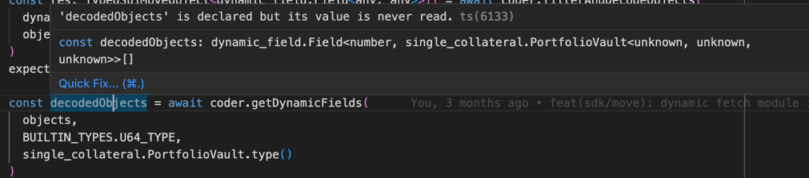

# Typemove 
Generate TypeScript bindings for Sui contracts.
## Features
 - Code generation for SUI smart contract based on ABI
 - Typesafe encode/decoding, object filtering, transaction building, etc
 - Automatically manage depended modules
 - BCS schema (WIP) 
## Usage
### Install package
```shell
yarn add @typemove/sui
```
or 

```shell
pnpm add @typemove/sui
```

### Code Generation
```typescript
yarn typemove-sui [--target-dir] [--network] [--abi-dir] <location>
```
- `location`: Directory of ABI json files or address of account to generate types for
- `target-dir`: Directory to output generated files (default: "./types")
- `network`:  Network to use, could be either "mainnet", "testnet" or any node URL (default: "mainnet")
- `abi-dir`:  Directory to store downloaded ABI. Only useful if <location> is address (default: "./abis")

Use `yarn typemove-sui --help` to see detail description.

A few examples:
- generate types for an address on mainnet:
    ```typescript
    yarn typemove-sui --target-dir=./src/types --abi-dir=./src/abis 0x1e2b124f746a339b3cf99b9f969393a96594519aafb1d06517aacfeeae20e7a5 
    ```
- generate types for local ABI files stored in `./src/abis`:
    ```typescript
    yarn typemove-sui --target-dir=./src/types ./src/abis
    ```
- generate types using local node:
    ```typescript
    yarn typemove-sui --network="http://localhost:8080" 0x48271d39d0b05bd6efca2278f22277d6fcc375504f9839fd73f74ace240861af
  ```

### Decode Object
```typescript
import { defaultMoveCoder } from '../move-coder.js'
import { single_collateral } from './types/testnet/0xebaa2ad3eacc230f309cd933958cc52684df0a41ae7ac214d186b80f830867d2.js'

const res = await defaultMoveCoder().decodedType(
  data,
  single_collateral.Info.type()
)
```

<details>
  <summary>Without TypeMove</summary>

```typescript
export interface Info {
  index: string;
  creator: string;
  createTsMs: string;
  round: string;
  deliveryInfo?: DeliveryInfo;
}
export interface DeliveryInfo {
  round: string;
  price: string;
  size: string;
  premium: string;
  tsMs: string;
}

let deliveryInfo: DeliveryInfo | undefined =
    // @ts-ignore
    data.content.fields.info.fields.delivery_info
        ? {
          // @ts-ignore
          round: data.content.fields.info.fields.delivery_info.fields.round,
          // @ts-ignore
          price: data.content.fields.info.fields.delivery_info.fields.price,
          // @ts-ignore
          size: data.content.fields.info.fields.delivery_info.fields.size,
          // @ts-ignore
          premium: data.content.fields.info.fields.delivery_info.fields.premium,
          // @ts-ignore
          tsMs: data.content.fields.info.fields.delivery_info.fields.ts_ms,
        }
        : undefined;
let info: Info = {
  // @ts-ignore
  index: data.content.fields.info.fields.index,
  // @ts-ignore
  creator: data.content.fields.info.fields.creator,
  // @ts-ignore
  createTsMs: data.content.fields.info.fields.create_ts_ms,
  // @ts-ignore
  round: data.content.fields.info.fields.round,
  deliveryInfo,
};

```
</details>


### Decode dynamic fields
Get objects with specified type from a list of dynamic objects, and access field with fully typed object
```typescript
const decodedObjects = await coder.getDynamicFields(
    objects,
    BUILTIN_TYPES.U64_TYPE,
    single_collateral.PortfolioVault.type()
)
console.log(decodedObjects[0].value.info.delivery_info?.price)
```
IDE could infer result type correctly.


### View Function
With type move, you could, call view functions and get decoded result very easily, e.g.
```typescript
import { _0x2 } from '@typemove/sui/builtin'

res = (await _0x2.math.view.min(client, [20n, 4n]))

console.log(res?.results_decoded[0])
```

Typemove's generated view function stubs wraps the `devInspectTransactionBlock` API and decode the result,
it adds an fully typed `results_decoded` field to the result object. e.g. the above `min` function generated has type annotation as below: 

```typescript
module math {
  export async function min(
      client: SuiClient,
      args: [bigint | TransactionArgument, bigint | TransactionArgument],
  ): Promise<TypedDevInspectResults<[bigint]>> {
  ...
  }
}
```

### Building transaction
Similar to original transaction building process, but you could use generated builder function to replace the 
`txb.moveCall`.

```typescript
import { clob_v2 } from './types/testnet/0xdee9.js'

const client = new SuiClient({ url: getFullnodeUrl('testnet') })
const tx = new TransactionBlock()
clob_v2.builder.createAccount(tx, ["0xd9e6dc1e7f0790c18acf96b629f0a236d56de2f96537d921197bcb0e071b12bd"])
    ... more tx build 
client.signAndExecuteTransactionBlock({transactionBlock: tx, signer: keypair})
```

Checkout our [tests](./src/tests/move-call.test.ts) for more examples.